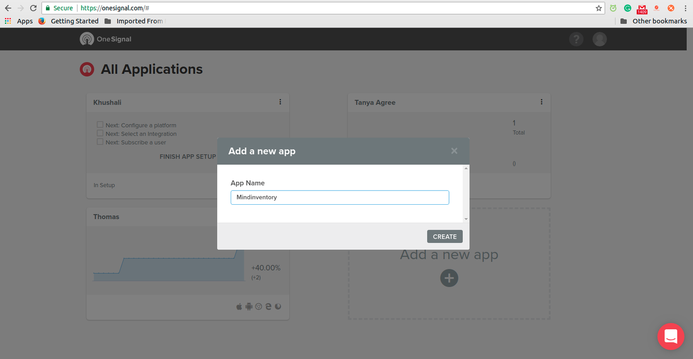

## Onesignal-node


OneSignal is a high volume and reliable push notification service for websites and mobile applications. We support all major native and mobile platforms by providing dedicated SDKs for each platform, a RESTful server API, and an online dashboard for marketers to design and send push notifications.


### Technologies used:
* Node

### Getting Started

These instructions will get you a copy of the project up and running on your local machine for development and testing purposes. See deployment for notes on how to deploy the project on a live system.
What things you need to install the software and how to install them


## Table of Contents
* [Prerequisites](#prerequisites)
* [Installation](#installation)
* [Usage](#usage)
  * [For Web Push Notification](#for-web-push-notification)
  * [For Android Device Push Notification](#for-android-device-push-notification)
 

## Prerequisites

First, we need to create new project in OneSignal.

###### Step 1: 

> Create accout and Login into onesignal (https://onesignal.com/) & create new project



> Click “add your project” & get keys


## Installation


### Create  a js file
```bush
    npm install onesignal-node --save
```
``` js
var OneSignal = require('onesignal-node');
```
Or

```bush
    <script src="https://cdn.onesignal.com/sdks/OneSignalSDK.js" async></script>
```

## For Web Push Notification

- Download getSubcribe.html and sendPushNotification.js file

- Replace your appID in getSubcribe.html file (you will find appID from onesignal account)

- Open getSubcribe.html file and click on subscribe button

- After clicking on subscribe button your token will be stored in your onesignal account ( you can check in user tab )

- Open sendPushNotification.js file and change the following details :

``` js
        var headers = {
            "Content-Type": "application/json; charset=utf-8",
            "Authorization": "Basic (YOUR REST API KEY)" // Replace with yours Auth
          };


        var message = {
          app_id: "YOUR APP ID", // Replace with your app_id
          contents: {"en": "English Message"},            // change text ( Optional)
          included_segments: ["Active Users"]
        };
```
- Now, run sendPushNotification.js using this command
```
 $ node sendPushNotification.js
```

> You will get notification in web view.


## For Android Device Push Notification

- To get push notification in android device you need to install this oneSignalTesk.apk

- Open this app and click on subscribe button

- Now run sendPushNotification.js using command 'node sendPushNotification.js'

- Congratulation, you will get notification in your android app.

- For more detail you can visit http://androidbash.com/android-push-notification-service-using-onesignal/

    ( you can modify the apk : https://github.com/android-bash/OneSignal.git by changing project id and google server key.
      you have to create project in Firebase to get projectid and google server key )
      
> You will get notification in mobile.
    


## LICENSE!

CoverFlow is [MIT-licensed](https://github.com/mindinventory1/one-signal-push-notification-with-nodejs/blob/master/LICENSE)

## Let us know!
We’d be really happy if you sent us links to your projects where you use our component. Just send an email to sales@mindinventory.com And do let us know if you have any questions or suggestion regarding our work.


